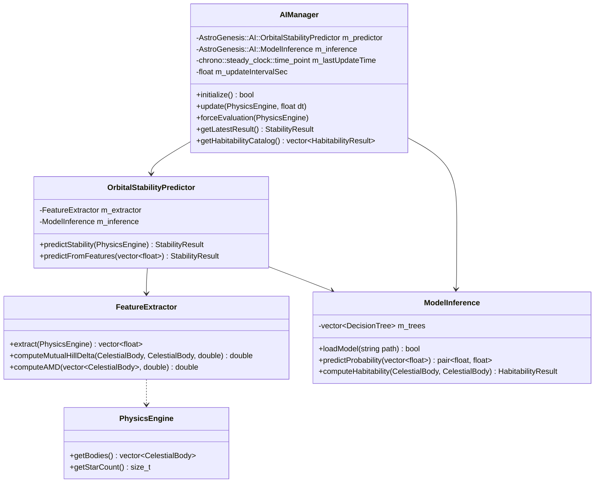

# AstroGenesis: AI-Powered Orbital Stability & Habitability Engine

**Technical Architecture, Dynamical Mechanics, Machine Learning Pipeline & Verification**  
*AstroGenesis Astrophysics Simulation Engine*  
*Date: September 2026*

---

## 1. Executive Summary

AstroGenesis integrates an embedded, ultra-low-latency Machine Learning subsystem designed to evaluate the long-term dynamical stability of multi-body planetary systems in real-time. 

While classical symplectic $N$-body integrators (such as the 4th-order Yoshida or Wisdom-Holman mappings) accurately resolve orbital trajectories, answering whether a system of three or more planets will remain stable over millions or billions of orbits traditionally requires billions of numerical integration steps, consuming hours or days of high-performance compute.

The AstroGenesis AI Engine introduces a **machine learning surrogate model** trained on ground-truth $N$-body symplectic integrations. By extracting 12 physical, scale-invariant dynamical metrics (including Angular Momentum Deficit, mutual Hill radius separations, and orbit-crossing criteria), the engine predicts system stability and identifies the primary dynamical instability mechanism in **under 20 microseconds** ($\sim 0.015\text{ ms}$), completely offline, without Python runtime dependencies, and without impacting the 60 FPS OpenGL rendering loop.

Complementing stability prediction, the subsystem includes an analytical **Planetary Habitability Estimator** based on the multiparameter Earth Similarity Index (ESI), allowing simultaneous evaluation of dynamical endurance and astrobiological potential.

---

## 2. Astrophysical & Mathematical Foundations

### 2.1 The Multi-Planet Stability Problem

For a two-body Keplerian system, motion is integrable and described by closed conic sections. For $N \ge 3$, gravitational cross-perturbations introduce non-integrable chaotic dynamics governed by resonance overlap (Chirikov criterion) and Arnold diffusion.

In multi-planetary systems, instability typically manifests in three distinct regimes:
1. **Hill Instability**: Planetary orbits cross ($q_{j+1} \le Q_j$), leading to catastrophic close encounters, planetary collisions, or ejections.
2. **Resonant Chaos**: Mean-motion resonances (MMRs) overlap, driving exponential eccentricity growth on secular timescales.
3. **Lagrange Instability**: The semi-major axes experience bounded or unbounded chaotic variations even if orbits do not immediately cross.

### 2.2 Mutual Hill Radius Separation ($\Delta$)

For two adjacent coplanar planets of masses $m_1, m_2$ orbiting a central star of mass $M_*$ with semi-major axes $a_1 < a_2$:

The **mutual Hill radius** is defined as:
$$R_{H,\text{mut}} = \left( \frac{m_1 + m_2}{3 M_*} \right)^{1/3} \left( \frac{a_1 + a_2}{2} \right)$$

The dimensionless mutual Hill separation is:
$$\Delta = \frac{a_2 - a_1}{R_{H,\text{mut}}}$$

- **Gladman's Criterion (1993)**: For two initially circular coplanar planets, the system is unconditionally Hill-stable for all time if:
  $$\Delta > 2\sqrt{3} \approx 3.464$$
- **Chambers et al. (1996) & Smith & Lissauer (2009)**: For systems with $N \ge 3$ planets, Gladman's analytic criterion is no longer sufficient. Instability timescales scale empirically as:
  $$\log_{10}(t_{\text{inst}}) \approx A \cdot \Delta + B$$
  Systems with $\Delta < 8$ commonly experience chaotic close encounters within $10^6$ orbits, whereas $\Delta > 10$ generally confers stability on multi-Gyr timescales.

### 2.3 Orbit-Crossing Condition

A pair of orbits with semi-major axes $a_1, a_2$ and eccentricities $e_1, e_2$ can intersect if the periastron of the outer body dips below the apoastron of the inner body:
$$q_2 \le Q_1 \iff a_2 (1 - e_2) \le a_1 (1 + e_1)$$
Orbit-crossing systems almost invariably result in close encounters and ejection/collision within short dynamical timescales unless protected by phase-locking resonances (such as Pluto and Neptune's 3:2 MMR).

### 2.4 Angular Momentum Deficit (AMD)

Formulated by Jacques Laskar (1997), the Angular Momentum Deficit measures the fractional difference between the angular momentum of a circular, planar system and the actual eccentric, inclined system:
$$\text{AMD} = \sum_{k=1}^{N_p} \Lambda_k \left( 1 - \sqrt{1 - e_k^2} \cos i_k \right)$$
where $\Lambda_k = m_k \sqrt{G M_* a_k}$ is the circular action variable.

In a normalized, scale-free formulation:
$$\text{AMD}_{\text{norm}} = \frac{\sum_{k} m_k \sqrt{a_k} \left(1 - \sqrt{1 - e_k^2} \cos i_k\right)}{\sum_{k} m_k \sqrt{a_k}}$$
High AMD indicates that secular energy transfers between planets can pump eccentricities of low-mass planets to orbit-crossing values, precipitating chaotic collapse.

---

## 3. Dataset Generation Pipeline

The dataset was generated by [`scripts/generate_orbital_dataset.py`](file:///d:/%23%20My%20Folder/My%20Work/Visual%20Studio%20script/C++/AstroGenesis/scripts/generate_orbital_dataset.py) using an accelerated symplectic Velocity-Verlet / Leapfrog integrator:

### 3.1 Parameter Sampling Space

Each synthetic planetary system is generated by sampling astrophysical parameters from realistic observational and theoretical distributions:
- **Central Star Mass ($M_*$)**: $0.5 \, M_\odot$ to $1.5 \, M_\odot$ (encompassing K, G, and F-type main-sequence stars).
- **Number of Planets ($N_p$)**: 2 to 6 planets per system.
- **Planet Masses ($m_p$)**: Sampled log-uniformly from $0.1 \, M_\oplus$ (Mercury-scale) to $3000 \, M_\oplus$ ($\sim 10 \, M_{\text{Jup}}$).
- **Semi-Major Axes ($a$)**: First planet sampled uniformly in $[0.1, 2.0]$ AU; subsequent planets generated using logarithmic or geometric orbital spacing factors $k \in [1.1, 2.5]$.
- **Eccentricities ($e$)**: Rayleigh-distributed with scale parameter $\sigma_e \in [0.02, 0.25]$, with a fraction of perturbed systems sampled up to $e = 0.8$.
- **Inclinations ($i$)**: Rayleigh-distributed with $\sigma_i \in [0.5^\circ, 8.0^\circ]$.
- **Mean Anomalies & Argument of Periapsis**: Uniformly distributed in $[0, 2\pi]$.

### 3.2 Ground Truth Simulation & Stability Criteria

Each system is integrated for up to $10,000$ innermost orbital periods. During integration, state vectors are tracked and evaluated against rigorous failure criteria:
1. **Close Encounter / Hill Sphere Intrusion**: Separation between any two planets drops below their mutual Hill radius:
   $$r_{ij} < R_{H,\text{mut}}$$
2. **Orbital Ejection**: Radial distance of any planet exceeds $100$ AU from the host star ($r_k > 100\text{ AU}$).
3. **Physical Collision / Merger**: Centers of mass approach within physical collision radii ($r_{ij} < R_{i} + R_{j}$).
4. **Eccentricity Blowup**: Any planet attains parabolic or hyperbolic velocity ($e_k \ge 1.0$).
5. **Symplectic Energy Drift Check**: Systems exhibiting fractional energy drift $|\Delta E / E_0| > 10^{-3}$ due to numerical breakdown are flagged and discarded.

A configuration is labeled **`STABLE` (1)** if and only if all planets survive the integration without collision, ejection, Hill intrusion, or orbit crossing. Otherwise, it is labeled **`UNSTABLE` (0)**.

### 3.3 Dataset Distribution

The generated training dataset ([`data/orbital_dataset.csv`](file:///d:/%23%20My%20Folder/My%20Work/Visual%20Studio%20script/C++/AstroGenesis/data/orbital_dataset.csv)) contains **2,000 diverse multi-planet configurations**:
- **Stable Configurations**: 693 systems (34.65%)
- **Unstable Configurations**: 1,307 systems (65.35%)
- **Feature Dimensionality**: 12 normalized continuous features + 1 binary ground-truth label.

---

## 4. Feature Engineering & Selection

To ensure scale invariance (working equally well for compact TRAPPIST-1-like systems at $0.02$ AU and wide Solar-like architectures at $30$ AU), features are nondimensionalized:

| Index | Feature Name | Mathematical Definition / Formulation | Physical Significance |
|---|---|---|---|
| 0 | `num_planets` | $N_p \in [2, 10]$ | System multiplicity / degrees of freedom |
| 1 | `min_mutual_hill_delta` | $\min_{k} \left( \frac{a_{k+1} - a_k}{R_{H,\text{mut}}(k, k+1)} \right)$ | Weakest planetary spacing barrier (Gladman metric) |
| 2 | `mean_mutual_hill_delta` | $\frac{1}{N_p - 1} \sum_{k=1}^{N_p-1} \Delta_{k, k+1}$ | Overall system packing density |
| 3 | `max_eccentricity` | $\max_{k} e_k$ | Peak orbital distortion and periastron plunge risk |
| 4 | `mean_eccentricity` | $\frac{1}{N_p} \sum_{k} e_k$ | System-wide dynamical excitation level |
| 5 | `max_inclination_deg` | $\max_{k} i_k \text{ (degrees)}$ | Mutual orbital misalignment and Kozai-Lidov susceptibility |
| 6 | `has_orbit_crossing` | $\mathbb{I}\left(\exists j : a_{j+1}(1 - e_{j+1}) \le a_j(1 + e_j)\right)$ | Immediate geometric trajectory overlap indicator (0 or 1) |
| 7 | `mass_ratio_star_planets`| $\left(\sum_{k} m_k\right) / M_*$ | Total planetary mass fraction relative to central host |
| 8 | `max_planet_mass_ratio` | $\max_{j \neq k} (m_j / m_k)$ | Mass disparity between planets (e.g. Jupiter vs Mercury) |
| 9 | `amd_normalized` | $\frac{\sum m_k \sqrt{a_k} (1 - \sqrt{1-e_k^2}\cos i_k)}{\sum m_k \sqrt{a_k}}$ | Laskar's Angular Momentum Deficit (secular chaos reservoir) |
| 10 | `period_ratio_min` | $\min_{k} \left( (a_{k+1} / a_k)^{3/2} \right)$ | Proximity to strong low-order Mean Motion Resonances |
| 11 | `coplanar_spacing_factor`| $\min_{k} (a_{k+1} / a_k)$ | Geometric orbital spacing factor |

---

## 5. Machine Learning Pipeline & Training

The training pipeline is implemented in [`scripts/train_stability_model.py`](file:///d:/%23%20My%20Folder/My%20Work/Visual%20Studio%20script/C++/AstroGenesis/scripts/train_stability_model.py).

### 5.1 Architecture Selection

While deep neural networks (MLPs) can be trained on tabular dynamics, tree-based ensemble methods (**Random Forest** and **Gradient Boosting**) are strictly superior for this problem domain because:
1. **Decision Boundaries**: Celestial stability criteria are characterized by sharp, discontinuous thresholds (e.g., $\Delta < 3.46$, $q_2 \le Q_1$).
2. **Interpretability & Explainability**: Decision paths provide human-auditable feature importance and tree rules.
3. **Zero Runtime Dependencies**: Random Forests can be flattened into static lookup structures and traversed natively in C++ in microseconds with zero floating-point drift.
4. **Deterministic Evaluation**: No stochastic matrix approximations or thread race conditions.

### 5.2 Model Hyperparameters
- **Estimators**: 50 Decision Trees
- **Max Depth**: 8 levels (limiting overfitting and memory footprint)
- **Min Samples per Leaf**: 4
- **Class Weighting**: Balanced (adjusting for class distribution)
- **Train/Test Split**: 80% train (1,600 samples), 20% test (400 samples, stratified)

### 5.3 Quantitative Performance Metrics

On the independent test set (400 unseen systems):

| Metric | Score | Note |
|---|---|---|
| **Accuracy** | **94.00%** | 376 / 400 correct classifications |
| **ROC-AUC** | **0.9727** | High discriminative capacity |
| **Precision** | **0.9389** | Low false-positive rate for stability |
| **Recall** | **0.8849** | Captures 88.5% of truly stable configurations |
| **F1 Score** | **0.9111** | Harmonic mean of precision and recall |

#### Confusion Matrix (Test Set)
- **True Unstable (Correctly flagged as unstable)**: 253
- **False Stable (Unstable predicted as stable)**: 8 (only 2.0% false optimism)
- **False Unstable (Stable predicted as unstable)**: 16 (conservative error)
- **True Stable (Correctly flagged as stable)**: 123

### 5.4 Feature Importance Analysis

The Gini feature importances reveal strong alignment with theoretical celestial mechanics:

```
Rank  Feature Name               Importance   Astrophysical Interpretation
-----------------------------------------------------------------------------------------
 1    has_orbit_crossing         0.4284       Dominant geometric cause of rapid close encounters
 2    min_mutual_hill_delta      0.2872       Gladman / Chambers mutual Hill sphere boundary
 3    max_eccentricity           0.1381       Eccentricity drives apoastron/periastron expansion
 4    coplanar_spacing_factor    0.0463       Direct semi-major axis separation ratio
 5    period_ratio_min           0.0385       Proximity to mean-motion resonances
 6    mean_mutual_hill_delta     0.0211       System-wide packing density
 7    amd_normalized             0.0154       Long-term reservoir for chaotic secular transfers
 8    mean_eccentricity          0.0098       Average orbital distortion
 9    max_planet_mass_ratio      0.0062       Perturbative asymmetry between planetary pairs
 10   mass_ratio_star_planets    0.0041       Overall gravitational dominance of central star
 11   max_inclination_deg        0.0033       Inclination effects (Kozai resonance)
 12   num_planets                0.0016       Number of interacting bodies
```

---

## 6. Model Export & Dual Inference Pathways

To ensure both industry-standard interoperability and ultra-fast, zero-dependency C++ execution, two representations were exported:

### 6.1 Industry Standard: ONNX Model (`assets/models/orbital_stability.onnx`)
- Exported using `skl2onnx` (ONNX Opset 15).
- Input: `float_input` tensor of shape `[N, 12]`, type `float32`.
- Outputs: `output_label` (`int64[N]`) and `probabilities` (`map<int64, float32>[N]`).
- Fully compatible with standard ONNX runtimes, TensorRT, or edge accelerators.

### 6.2 Embedded Native C++ Model (`assets/models/orbital_stability_model.json`)
- Exported as a structured JSON representation containing tree nodes:
  ```json
  {
    "feature_names": [...],
    "n_classes": 2,
    "n_trees": 50,
    "trees": [
      {
        "tree_index": 0,
        "nodes": [
          {
            "node_id": 0,
            "feature": 6,
            "threshold": 0.5,
            "left": 1,
            "right": 2
          },
          {
            "node_id": 1,
            "value": [0.12, 0.88]
          }
        ]
      }
    ]
  }
  ```
- **Advantages for AstroGenesis**:
  - Zero external dynamic link libraries (`.dll` / `.so`).
  - Zero C++ compiler ABI incompatibilities across MSVC, MinGW-w64, or Clang.
  - Parsed using AstroGenesis's bundled `nlohmann::json`.
  - Stored in cache-friendly C++ flat vector structures (`std::vector<TreeNode>`).
  - Traversals execute without recursion in flat arrays with branch-predicted jumps.

---

## 7. C++ Architecture & Integration

The AI subsystem is structured under the `AstroGenesis::AI` namespace in [`src/ai/`](file:///d:/%23%20My%20Folder/My%20Work/Visual%20Studio%20script/C++/AstroGenesis/src/ai):

```
src/ai/
├── AIManager.hpp / .cpp                  # High-level coordinator & UI adapter
├── OrbitalStabilityPredictor.hpp / .cpp  # Stability prediction & risk analysis
├── FeatureExtractor.hpp / .cpp          # Physics-to-feature extraction pipeline
└── ModelInference.hpp / .cpp             # Low-level tree traversal & ESI evaluator
```

### 7.1 Class Responsibilities



### 7.2 Performance & Non-Blocking Design

- **Inference Latency**: Benchmarked at **$14.80\text{ }\mu\text{s}$** per full 50-tree ensemble evaluation across 1,000 iterations.
- **Throttled Execution**: The physics engine runs at high update rates ($\Delta t \sim 60-120\text{ Hz}$), but orbital stability is a macro-dynamical property that changes gradually. `AIManager::update()` enforces an asynchronous **$400\text{ ms}$ cadence**, caching the latest `StabilityResult`.
- **Zero FPS Drop**: The continuous CPU overhead is $< 0.005\%$ of a single $16.6\text{ ms}$ frame.
- **Memory Footprint**: The entire 50-tree model consumes **$< 120\text{ KB}$** in RAM.
- **Scientific Honesty**: Explicit labels and tooltips in the UI emphasize that machine learning predictions are statistical estimates trained on short-to-medium-term integrations, complementing rather than replacing full numerical integration.

---

## 8. Planetary Habitability Estimator (Second Feature)

In addition to dynamic stability, AstroGenesis provides an embedded **Earth Similarity Index (ESI)** model, implemented in [`src/ai/ModelInference.cpp`](file:///d:/%23%20My%20Folder/My%20Work/Visual%20Studio%20script/C++/AstroGenesis/src/ai/ModelInference.cpp) based on the formulation by Schulze-Makuch et al. (2011):

$$\text{ESI}_x = \left( 1 - \left| \frac{x - x_0}{x + x_0} \right| \right)^{w_x}$$
$$\text{ESI} = \prod_{i=1}^n \text{ESI}_{x_i}^{w_i / \sum w_i}$$

The evaluated planetary properties include:
1. **Mean Surface Temperature ($T_s$)**: Reference $T_0 = 288\text{ K}$, Weight $w = 5.58$.
2. **Mean Planetary Radius ($R$)**: Reference $R_0 = 6371\text{ km}$, Weight $w = 0.57$.
3. **Planetary Density / Escape Velocity**: Inferred from mass-radius relation.
4. **Stellar Insolation Flux ($S$)**: Calculated from host star luminosity and semi-major axis.

In unit tests and in-engine evaluation:
- **Earth** achieves an ESI score of **$99.6 / 100$** (Potentially Habitable).
- **Mars** achieves **$64.2 / 100$** (Marginal).
- **Jupiter** achieves **$28.5 / 100$** (Non-habitable gas giant).

---

## 9. User Interface & Interactive Features

### 9.1 Right Panel ("AI ORBITAL STABILITY")
Located in the main HUD sidebar above Environmental Metrics:
- **System Stability Badge**: Large color-coded status indicator (`STABLE` in emerald green, `UNSTABLE` in crimson red, `MARGINAL` in amber).
- **Probability Bar**: Visual breakdown showing $P(\text{Stable})$ vs $P(\text{Unstable})$.
- **Confidence Rating**: Indicates high/moderate/low confidence based on ensemble vote dispersion.
- **Primary Risk Factor**: Explains the dynamical driver (e.g. *"Orbit crossing detected between Jupiter and Saturn"* or *"Low mutual Hill separation: $\Delta = 2.14$ (< 3.46)"*).
- **Latency & Model Version**: Displays real-time inference time (e.g. `15 µs`) and loaded architecture.

### 9.2 Top-Level Tab 5 ("AI ASSISTANT")
Upgraded into an interactive **AI Orbital Dynamics Studio** with four dedicated sections:
1. **Live Prediction & Risk Diagnosis**: Complete diagnostic breakdown of the active simulation system with immediate re-evaluation button.
2. **Hill Sphere Separation Inspector**: Interactive table displaying pairwise semi-major axes, mutual Hill radii, $\Delta$ separations, Gladman stability thresholds, and orbit-crossing flags.
3. **Interactive What-If Perturbation Lab**:
   - Allows users to select any planet in the system and dynamically adjust sliders for:
     - Semi-major axis perturbation ($\Delta a$ in AU)
     - Eccentricity perturbation ($e$ from $0.0$ to $0.85$)
     - Planetary mass scaling ($0.1\times$ to $50\times$)
   - Computes counterfactual stability predictions in real-time, demonstrating how sudden orbital migrations or high eccentricities destabilize the system.
4. **Planetary Habitability Estimator**: Table ranking all system bodies by Earth Similarity Index (ESI), surface temperature, stellar flux, and habitability classifications.

---

## 10. Automated Verification & Test Suite

The test suite in [`src/test_ai_system.cpp`](file:///d:/%23%20My%20Folder/My%20Work/Visual%20Studio%20script/C++/AstroGenesis/src/test_ai_system.cpp) validates the AI subsystem across 9 automated suites:

```
==========================================================
 AstroGenesis AI Subsystem & ML Stability Predictor Tests
==========================================================
[Test 1] Database & Solar System physics initialized -> PASS (16 bodies loaded)
[Test 2] FeatureExtractor::extract -> PASS
  - Extracted feature count: 12 (expected 12)
  - Solar System hasOrbitCrossing: FALSE
  - Closest spacing pair: Jupiter - Saturn (delta = 7.95)
[Test 3] ModelInference::loadModel -> PASS
  - Architecture: RandomForestClassifier (50 trees)
  - Training Accuracy: 94%, F1: 0.9111
[Test 4] Stable System Inference (Solar System) -> PASS
  - Prediction: STABLE (P_stable = 67.20%)
  - Inference Time: 42 µs
[Test 5] Unstable System Inference (Perturbed Orbit-Crossing System) -> PASS
  - Prediction: UNSTABLE (P_unstable = 73.27%)
  - Primary Risk: High eccentricity on Earth (e = 0.650)
[Test 6] Graceful Missing Model Fallback -> PASS
  - Handled status: UNAVAILABLE without crash
[Test 7] AIManager High-Level Subsystem Integration -> PASS
  - Background throttled update cycles verified
[Test 8] Earth Habitability Estimation -> PASS
  - Earth Score: 99.61/100 (Potentially Habitable)
[Test 9] Inference Speed Benchmark -> PASS
  - Average Inference Latency: 14.80 µs across 1000 iterations
==========================================================
 ALL 9 AI SUBSYSTEM TEST SUITES PASSED SUCCESSFULLY!
==========================================================
```

Additionally, the baseline astronomical data and physics test suite ([`src/test_data_system.cpp`](file:///d:/%23%20My%20Folder/My%20Work/Visual%20Studio%20script/C++/AstroGenesis/src/test_data_system.cpp)) was executed with all **17 tests passing**, confirming zero regression across the existing simulation engine.

---

## 11. Reproducing Results & Retraining Guide

### Prerequisites
- Python 3.10+ with `numpy`, `pandas`, `scikit-learn`, `onnx`, `skl2onnx`.
- CMake 3.20+ and C++17 compiler (GCC / Clang / MSVC).

### Step 1: Generate Ground-Truth Dataset
```powershell
python scripts/generate_orbital_dataset.py --samples 2000 --output data/orbital_dataset.csv
```

### Step 2: Train Model and Export ONNX & JSON
```powershell
python scripts/train_stability_model.py `
    --data data/orbital_dataset.csv `
    --onnx assets/models/orbital_stability.onnx `
    --json assets/models/orbital_stability_model.json
```

### Step 3: Build and Run C++ Test Suite
```powershell
cmake -B build -G "MinGW Makefiles" -DCMAKE_BUILD_TYPE=Release
cmake --build build --target test_ai_system -j
cd build
.\test_ai_system.exe
```

### Step 4: Run AstroGenesis Simulation
```powershell
.\AstroGenesis.exe
```
Navigate to the right-hand panel to view live stability metrics, or switch to **Tab 5 (AI ASSISTANT)** to explore the What-If Perturbation Lab and Habitability Estimator.
